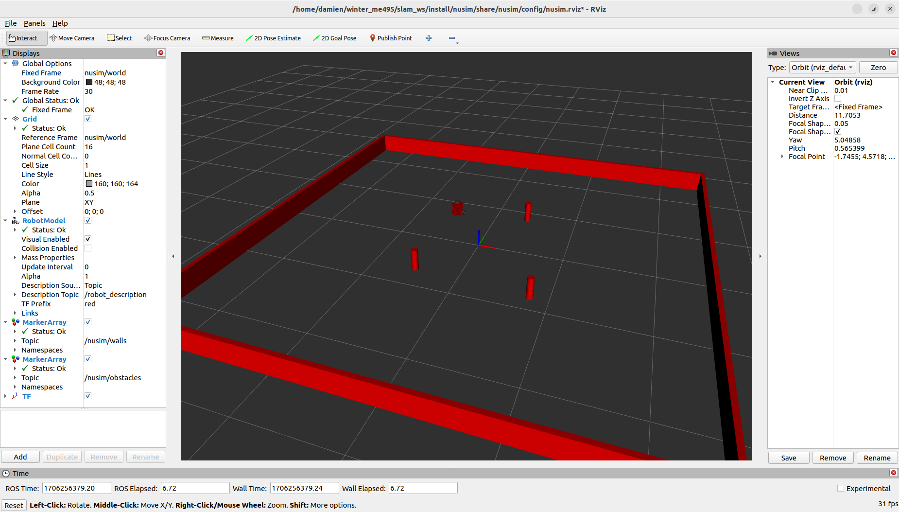

# NUSIM
Author: Damien Koh

## Package Description
This package uses `nuturtle_description` to simulate a turtlebot in ROS, which is visualized in rviz.
This turtlebot simulation utilizes various ROS systems, including `tf`, `markers`, and `URDF`.

## Quickstart
1. Use the following command to run the simulator's launch file:
    ```
    ros2 launch nusim nusim.launch.xml
    ``` 
    This simulation includes a turtlebot in a customizable arena, where the number and position of obstacles and dimension of said arena can be adjusted.

2. Simulator parameters include:
    1. `frequency`: Controls the frequency (and therefore size) of the timesteps' occurances in the simulator.
    2. `x, y, theta`: Controls the starting position of the turtlebot.
    3. `arena_x_length, arena_y_length`: Controls the dimensions of the rviz arena.
    4. `obstacles/x, obstacles/y`: List of x and y coordinates of arena obstacles.
    5. `obstacles/r`: The radius of all arena obstacles.

# Gallery
Screenshot of the `nusim.launch.xml` launch file being run:

