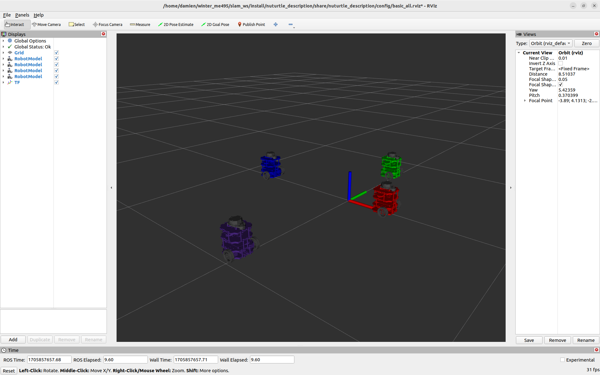

# Nuturtle Description
URDF files for NUturtle Leonardo
* `ros2 launch nuturtle_description load_one.launch.py` to see the robot it rviz.
* `ros2 launch nuturtle_description load_all.launch.xml` to see four copies of the robot in rviz.

* The rqt_graph when all four robots are visualize (Node Only, Hide Debug) is:


# Launch File Details
* Inputs:
    ```
    ros2 launch nuturtle_description load_one.launch.py --show-args
    ```
    Outputs:
    ```
    Arguments (pass arguments as '<name>:=<value>'):

    'use_rviz':
        Whether to launch rviz
        (default: 'true')

    'use_jsp':
        Whether the joint state publisher publishes default states
        (default: 'true')

    'color':
        The color of the turtlebot in rviz. Valid choices are: ['purple', 'red', 'green', 'blue']
        (default: 'purple')

    'namespace':
        The namespace of the turtlebot in rviz
        (default: LaunchConfig('color'))
    ```
* Input
    ```
    ros2 launch nuturtle_description load_all.launch.xml --help
    ```
    Output
    ```
    Arguments (pass arguments as '<name>:=<value>'):

    'use_rviz':
        Whether to launch rviz
        (default: 'true')

    'use_jsp':
        Whether the joint state publisher publishes default states
        (default: 'true')

    'color':
        The color of the turtlebot in rviz. Valid choices are: ['purple', 'red', 'green', 'blue']
        (default: 'purple')

    'namespace':
        The namespace of the turtlebot in rviz
        (default: LaunchConfig('color'))

    ```